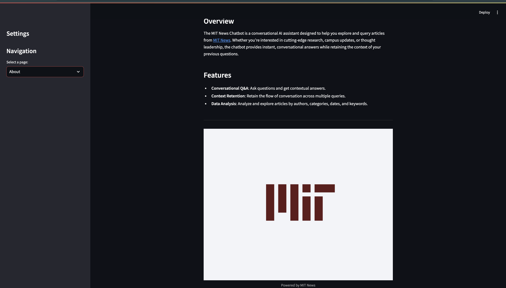
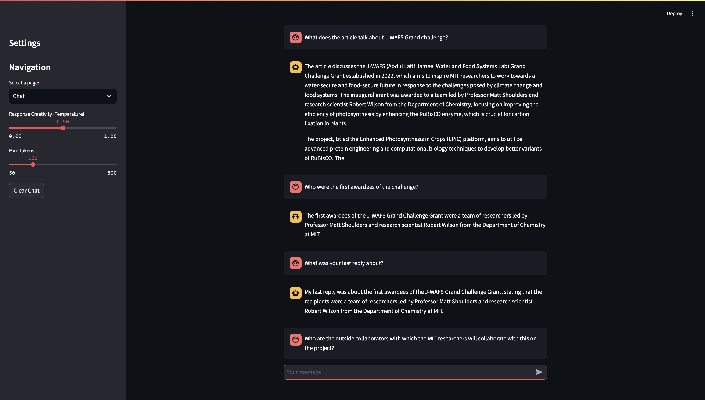
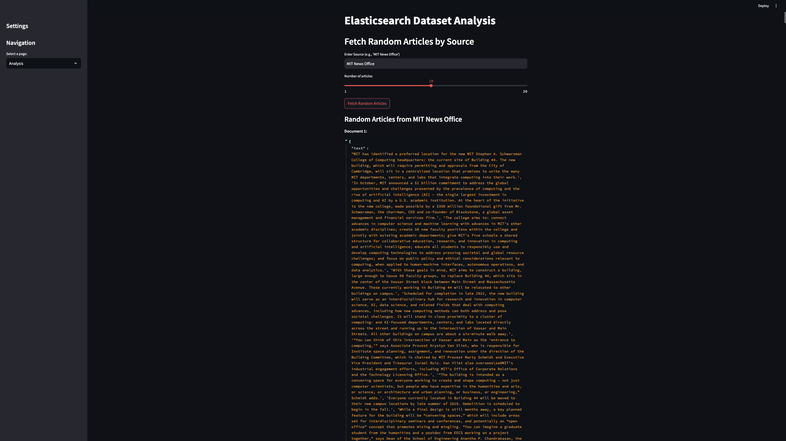

# **MIT News Chatbot**

🤖 **MIT News Chatbot** is a Streamlit-based application that enables users to interact with articles from [MIT News](https://news.mit.edu/) through conversational AI. The application combines advanced natural language processing with Elasticsearch-based retrieval systems, allowing users to query, analyze, and explore articles seamlessly.

---

## **Features**

### **1. About Page**
- Provides an overview of the application.
- Highlights:
  - Conversational Q&A capabilities.
  - Context-aware interactions.
  - Tools for exploring and analyzing article datasets.
- Includes details about the tech stack used.

### **2. Chat Page**
- A chatbot interface to answer questions in real time.
- Supports conversational context retention.
- Adjustable parameters:
  - **Temperature**: Controls response randomness.
  - **Max Tokens**: Limits response length.
- Includes a "Clear Chat" option to reset chat history.

### **3. Analysis Page**
- Tools for article exploration:
  - Fetch random articles by source.
  - Retrieve articles by specific authors or dates.
  - Search for content by keyword or heading.
- Displays results in JSON format for deeper exploration.

### **4. RAG Setup**
- Implements **Retrieval-Augmented Generation (RAG)**:
  - Retrieves relevant articles using Elasticsearch.
  - Reformulates questions to provide contextually accurate answers.
  - Uses GPT-4 for intelligent and educational responses.

### **5. Session Key Management**
- Keys are securely managed using the `session_keys` module, which retrieves environment variables for:
  - **OpenAI API Key**
  - **Elasticsearch Cloud ID**
  - **Elasticsearch API Key**

---

## **Tech Stack**

- **Frontend**: [Streamlit](https://streamlit.io)
- **Backend**: [Python](https://www.python.org/)
- **APIs**: [OpenAI API](https://platform.openai.com/docs/)
- **Search Engine**: [Elasticsearch](https://www.elastic.co/)

---

## **Screenshots**

Below are screenshots of the key pages in the application:

### **1. About Page**


### **2. Chat Page**


### **3. Analysis Page**


---

---


## **Installation**

Follow these steps to set up and run the application locally:

### **1. Clone the Repository**
```bash
git clone https://github.com/your-username/MIT-News-Chatbot.git
```

### **2. Set up a virtual environment**
```bash
python3 -m venv .venv
source .venv/bin/activate
```

### **3. Install Dependencies**
```bash
pip install -r requirements.txt
```

### **4. Add your API keys to environment**
```bash
export OPENAI_API_KEY="your-openai-api-key"
export ELASTIC_CLOUD_ID="your-elasticsearch-cloud-id"
export ELASTIC_API_KEY="your-elasticsearch-api-key"
```

### **5. Run the application**
```bash
streamlit run app.py
```